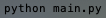
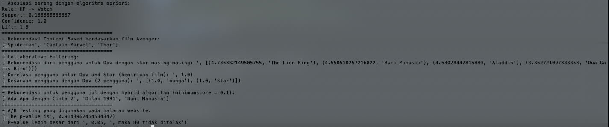
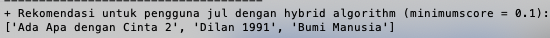

# Muhamad-Ramadan
collaborative filtering
# Recommendation-System-Algorithms
Dalam repo ini, terdapat algoritma sebagai berikut:

**1. Rekomendasi berdasarkan konten (Content based)**

**2. Rekomendasi berdasarkan user (Collaborative filtering)**

**3. Rekomendasi Hybrid (berdasarkan user & konten)**

**4. Asosiasi menggunakan algoritma Apriori**

**5. A/B Testing untuk menentukan UI yang lebih baik**

Menjalankan program diatas menggunakan file "main.py", commandnya seperti dibawah,

Dari command tersebut, menghasilkan keluaran seperti pada berikut,

Dalam repository ini, kita memiliki beberapa metode yang kita coba aplikasikan pada data yang berbeda pula. kita akan coba bahas satu persatu.

# 1. Rekomendasi berdasarkan konten (Content based)

Pada algoritma ini, rekomendasi dititik beratkan pada karakteristik konten yang ada. Algoritma ini menggunakan data film untuk diolah, yang berisi jenis, genre, rating, dan durasi. Pada tahapan ini dilakukan normalisasi dahulu terhadap data yang ada, lalu dilakukan perhitungan cosine similarity untuk menghitung kesamaan antar kontennya. Hasilnya sebagai berikut

# 2. Rekomendasi berdasarkan user (Collaborative filtering)

Collaborative filtering dapat menghasilkan banyak data, kita bisa mendapatkan user mana saja yang mengonsumsi konten yang sama, user yang memiliki selera yang sama dan bahkan dapat merekomendasikan konten kepada user berdasarkan rating yang diberikan oleh user lain. Pada algoritma ini digunakan data yang berisi user dan film yang sudah diberi rating oleh masing masing. Rating merupakan variable yang berisi dari angka 0 - 5, yang merepresentasikan skor yang diberikan oleh user kepada film yang telah ditonton. User akan memasukkan 0 jika belum pernah melihat, dan 5 jika user tersebut sangat suka konten filmnya. Hasilnya sebagai berikut

# 3. Rekomendasi Hybrid (berdasarkan user & konten)

# 4. Asosiasi menggunakan algoritma Apriori

# 5. A/B Testing untuk menentukan UI yang lebih baik
